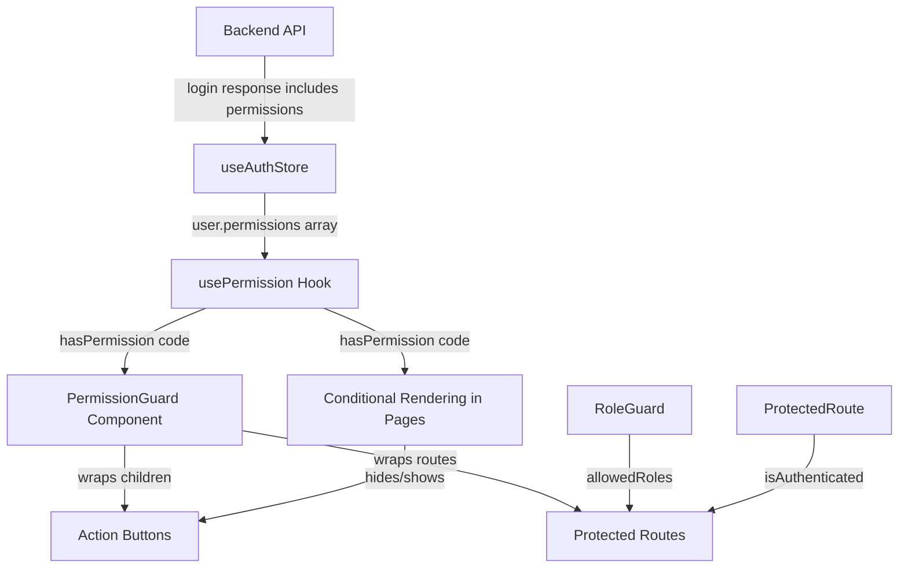

# Permission System Architecture & Action Button Mapping

## 1. Permission System Architecture

### 1.1 Current State

The application currently has a **role-based access control** system with **no granular permission checks on action buttons**.

#### Auth Store (`src/store/useAuthStore.js`)
- Stores `user`, `token`, `refreshToken`, `isAuthenticated`
- `user` object contains: `id`, `name`, `email`, `role`, `profile`
- **No `permissions` array** is stored on the user object
- Roles are string-based: `admin`, `guru`, `siswa`, `wali`, `staff` (numeric 1-4 mapping mentioned in RoleGuard comments)

#### RoleGuard (`src/components/guards/RoleGuard.jsx`)
- Accepts `allowedRoles` prop (array of role strings or numbers)
- Checks `user.role` against `allowedRoles` set
- If no access → redirects to `/unauthorized`
- **Currently NOT used anywhere in `App.jsx` routes** — all authenticated routes are only wrapped in `ProtectedRoute`

#### ProtectedRoute (`src/components/ProtectedRoute.jsx`)
- Only checks if user is authenticated (`isAuthenticated`)
- Handles silent token refresh on page reload
- Handles profile hydration for `guru`, `siswa`, `wali` roles
- **No permission/role-based route protection**

#### Backend Permission Model (from `src/features/roles/` services)
- Backend has full CRUD for: `permissions`, `roles`, `role-permissions`
- Permission entity has: `id`, `name`, `code`, `module`, `description`
- Permission code format: `module.action` (e.g., `waha.send`, `waha.notify.spp`, `waha.notify.ppdb`, `waha.notify.ews`)
- Roles can have multiple permissions assigned
- **Permissions are managed in backend but NOT loaded into frontend auth state**

#### ActionsMenu (`src/components/ui/ActionsMenu.jsx`)
- Shared component accepting: `onDetail`, `onEdit`, `onDelete`, `extraActions`
- Renders: Detail (Eye), extraActions (BarChart3), Edit (Edit), Hapus/Trash (Trash2)
- **No permission prop or awareness** — always renders all actions passed to it

### 1.2 Permission Naming Convention (from backend)

Based on the Waha feature comments and the roles/permissions backend:

```
{module}.{action}
```

Examples found:
- `waha.send`
- `waha.notify.spp`
- `waha.notify.ppdb`
- `waha.notify.ews`

### 1.3 Key Gaps

| Gap | Description |
|-----|-------------|
| No permission loading | `user.permissions` is never fetched/populated from backend |
| No button-level guards | Zero `RoleGuard` or permission checks on any action button |
| No route-level role guards | All routes only require authentication, not specific roles |
| Sidebar not filtered | Sidebar menu is loaded from backend API but no client-side role filtering confirmed |

---

## 2. Complete Action Button Mapping

### Legend
- **List page**: Page showing data grid/table
- **Detail page**: Page showing single record details
- **Form page**: Page for create/edit forms
- **Action types**: `create`, `edit`, `delete`, `view`, `submit`, `import`, `export`, `special`

### 2.1 Users & Access Management

| Feature | File | Button Label | Action | Has Permission Check? |
|---------|------|-------------|--------|----------------------|
| users | `UsersList.jsx` :343 | Tambah User | create | ❌ None |
| users | `UsersList.jsx` :307 | Detail (ActionsMenu) | view | ❌ None |
| users | `UsersList.jsx` :308 | Edit (ActionsMenu) | edit | ❌ None |
| users | `UsersList.jsx` :309 | Hapus (ActionsMenu) | delete | ❌ None |
| users | `UsersList.jsx` :310 | Toggle Status (ActionsMenu) | special | ❌ None |
| users | `UsersForm.jsx` :230 | Simpan | submit | ❌ None |
| users | `UsersDetail.jsx` :110 | Hapus | delete | ❌ None |
| users | `UsersDetail.jsx` :145 | Toggle Status | special | ❌ None |

### 2.2 Activity Logs

| Feature | File | Button Label | Action | Has Permission Check? |
|---------|------|-------------|--------|----------------------|
| activity-logs | `ActivityLogsList.jsx` | Detail (ActionsMenu) | view | ❌ None (read-only) |

### 2.3 Roles, Permissions & Menus

| Feature | File | Button Label | Action | Has Permission Check? |
|---------|------|-------------|--------|----------------------|
| roles | `RolesList.jsx` :110 | Tambah Role | create | ❌ None |
| roles | `RolesList.jsx` :80 | Detail/Edit/Hapus (ActionsMenu) | view/edit/delete | ❌ None |
| roles | `RolesForm.jsx` :239 | Simpan | submit | ❌ None |
| roles | `RolesDetail.jsx` :83 | Hapus | delete | ❌ None |
| permissions | `PermissionsList.jsx` :95 | Tambah Permission | create | ❌ None |
| permissions | `PermissionsList.jsx` :64 | Detail/Edit/Hapus (ActionsMenu) | view/edit/delete | ❌ None |
| permissions | `PermissionsForm.jsx` :189 | Simpan | submit | ❌ None |
| permissions | `PermissionsDetail.jsx` :72 | Hapus | delete | ❌ None |
| role-permissions | `RolePermissionsList.jsx` :99 | Tambah (Button) | create | ❌ None |
| role-permissions | `RolePermissionsList.jsx` :70 | Detail/Edit/Hapus (ActionsMenu) | view/edit/delete | ❌ None |
| role-permissions | `RolePermissionsForm.jsx` :584 | Simpan/Update | submit | ❌ None |
| role-permissions | `RolePermissionsDetail.jsx` :79 | Hapus | delete | ❌ None |
| menus | `MenuList.jsx` :231 | Tambah Menu | create | ❌ None |
| menus | `MenuList.jsx` :200 | Detail/Edit/Hapus (ActionsMenu) | view/edit/delete | ❌ None |
| menus | `MenuForm.jsx` :249 | Simpan | submit | ❌ None |
| menus | `MenuDetail.jsx` :70 | Hapus | delete | ❌ None |

### 2.4 Siswa

| Feature | File | Button Label | Action | Has Permission Check? |
|---------|------|-------------|--------|----------------------|
| siswa | `SiswaList.jsx` :282 | Tambah Siswa | create | ❌ None |
| siswa | `SiswaList.jsx` :267 | Import Excel | import | ❌ None |
| siswa | `SiswaList.jsx` :217 | Detail (ActionsMenu) | view | ❌ None |
| siswa | `SiswaList.jsx` :218 | Edit (ActionsMenu) | edit | ❌ None |
| siswa | `SiswaList.jsx` :219 | Hapus (ActionsMenu) | delete | ❌ None |
| siswa | `SiswaForm.jsx` :585 | Simpan | submit | ❌ None |
| siswa | `SiswaDetail.jsx` :102 | Hapus | delete | ❌ None |
| siswa | `ImportSiswaModal.jsx` :228 | Import | import | ❌ None |

### 2.5 Guru

| Feature | File | Button Label | Action | Has Permission Check? |
|---------|------|-------------|--------|----------------------|
| guru | `GuruList.jsx` :285 | Tambah Guru | create | ❌ None |
| guru | `GuruList.jsx` :240 | Detail/Edit/Hapus (ActionsMenu) | view/edit/delete | ❌ None |
| guru | `GuruForm.jsx` :303 | Simpan | submit | ❌ None |
| guru | `GuruDetail.jsx` :91 | Hapus | delete | ❌ None |

### 2.6 Wali

| Feature | File | Button Label | Action | Has Permission Check? |
|---------|------|-------------|--------|----------------------|
| wali | `WaliList.jsx` :271 | Tambah Wali | create | ❌ None |
| wali | `WaliList.jsx` :235 | Detail/Edit/Hapus (ActionsMenu) | view/edit/delete | ❌ None |
| wali | `WaliForm.jsx` :340 | Simpan | submit | ❌ None |
| wali | `WaliDetail.jsx` | Edit/Hapus buttons | edit/delete | ❌ None |

### 2.7 Kelas

| Feature | File | Button Label | Action | Has Permission Check? |
|---------|------|-------------|--------|----------------------|
| kelas | `KelasList.jsx` :307 | Tambah Kelas | create | ❌ None |
| kelas | `KelasList.jsx` :271 | View Siswa (ActionsMenu) | special | ❌ None |
| kelas | `KelasList.jsx` :272 | Detail (ActionsMenu) | view | ❌ None |
| kelas | `KelasList.jsx` :273 | Edit (ActionsMenu) | edit | ❌ None |
| kelas | `KelasList.jsx` :274 | Hapus (ActionsMenu) | delete | ❌ None |
| kelas | `KelasForm.jsx` :407 | Simpan | submit | ❌ None |
| kelas | `KelasDetail.jsx` :151 | Hapus | delete | ❌ None |

### 2.8 Mata Pelajaran (Mapel)

| Feature | File | Button Label | Action | Has Permission Check? |
|---------|------|-------------|--------|----------------------|
| mapel | `MapelList.jsx` :216 | Tambah Mata Pelajaran | create | ❌ None |
| mapel | `MapelList.jsx` :180 | Detail/Edit/Hapus (ActionsMenu) | view/edit/delete | ❌ None |
| mapel | `MapelForm.jsx` :149 | Simpan | submit | ❌ None |
| mapel | `MapelDetail.jsx` :80 | Hapus | delete | ❌ None |

### 2.9 Absensi Siswa

| Feature | File | Button Label | Action | Has Permission Check? |
|---------|------|-------------|--------|----------------------|
| absensi-siswa | `AbsensiSiswaList.jsx` :770 | Tambah Absensi | create | ❌ None |
| absensi-siswa | `AbsensiSiswaForm.jsx` :270 | Simpan | submit | ❌ None |
| absensi-siswa | `AbsensiSiswaDetail.jsx` | Edit/Hapus buttons | edit/delete | ❌ None |

### 2.10 Absensi Guru

| Feature | File | Button Label | Action | Has Permission Check? |
|---------|------|-------------|--------|----------------------|
| absensi-guru | `AbsensiGuruList.jsx` :250 | Tambah Absensi | create | ❌ None |
| absensi-guru | `AbsensiGuruForm.jsx` :251 | Simpan | submit | ❌ None |
| absensi-guru | `AbsensiGuruDetail.jsx` | Edit/Hapus buttons | edit/delete | ❌ None |

### 2.11 Nilai

| Feature | File | Button Label | Action | Has Permission Check? |
|---------|------|-------------|--------|----------------------|
| nilai | `NilaiList.jsx` :275 | Tambah Nilai | create | ❌ None |
| nilai | `NilaiList.jsx` :239 | Detail/Edit/Hapus (ActionsMenu) | view/edit/delete | ❌ None |
| nilai | `NilaiForm.jsx` :313 | Simpan | submit | ❌ None |
| nilai | `NilaiDetail.jsx` :97 | Hapus | delete | ❌ None |

### 2.12 Ujian

| Feature | File | Button Label | Action | Has Permission Check? |
|---------|------|-------------|--------|----------------------|
| ujian | `UjianList.jsx` :341 | Tambah Ujian | create | ❌ None |
| ujian | `UjianList.jsx` :290 | Detail/Edit/Hapus/Nilai (ActionsMenu) | view/edit/delete/special | ❌ None |
| ujian | `UjianForm.jsx` :407 | Simpan | submit | ❌ None |
| ujian | `UjianDetail.jsx` :96 | Hapus | delete | ❌ None |
| ujian | `UjianNilai.jsx` :320 | Simpan Perubahan | submit | ❌ None |

### 2.13 Soal (Bank Soal)

| Feature | File | Button Label | Action | Has Permission Check? |
|---------|------|-------------|--------|----------------------|
| soal | `SoalList.jsx` :276 | Tambah Soal | create | ❌ None |
| soal | `SoalList.jsx` :234 | Detail/Edit/Hapus (ActionsMenu) | view/edit/delete | ❌ None |
| soal | `SoalForm.jsx` :457 | Simpan | submit | ❌ None |
| soal | `SoalForm.jsx` :393 | Tambah Opsi | special | ❌ None |
| soal | `SoalDetail.jsx` :111 | Hapus | delete | ❌ None |

### 2.14 Ujian User (Siswa Ujian)

| Feature | File | Button Label | Action | Has Permission Check? |
|---------|------|-------------|--------|----------------------|
| ujian-user | `UjianUserList.jsx` :469 | Tambah | create | ❌ None |
| ujian-user | `UjianUserList.jsx` :393 | Detail/Edit/Hapus/Mulai (ActionsMenu) | view/edit/delete/special | ❌ None |
| ujian-user | `UjianUserForm.jsx` :293 | Simpan | submit | ❌ None |
| ujian-user | `UjianUserDetail.jsx` :146 | Mulai Ujian | special | ❌ None |
| ujian-user | `UjianUserMulai.jsx` :367 | Submit Ujian | submit | ❌ None |

### 2.15 Ujian Jawaban

| Feature | File | Button Label | Action | Has Permission Check? |
|---------|------|-------------|--------|----------------------|
| ujian-jawaban | `UjianJawabanList.jsx` :113 | Detail/Edit/Hapus (ActionsMenu) | view/edit/delete | ❌ None |
| ujian-jawaban | `UjianJawabanForm.jsx` :109 | Simpan | submit | ❌ None |

### 2.16 Tugas

| Feature | File | Button Label | Action | Has Permission Check? |
|---------|------|-------------|--------|----------------------|
| tugas | `TugasList.jsx` :292 | Tambah Tugas | create | ❌ None |
| tugas | `TugasList.jsx` :256 | Detail/Edit/Hapus (ActionsMenu) | view/edit/delete | ❌ None |
| tugas | `TugasForm.jsx` :383 | Simpan | submit | ❌ None |

### 2.17 Tugas Siswa (Pengumpulan)

| Feature | File | Button Label | Action | Has Permission Check? |
|---------|------|-------------|--------|----------------------|
| tugas-siswa | `TugasSiswaList.jsx` :297 | Tambah Pengumpulan | create | ❌ None |
| tugas-siswa | `TugasSiswaList.jsx` :261 | Detail/Grade/Hapus (ActionsMenu) | view/special/delete | ❌ None |
| tugas-siswa | `TugasSiswaForm.jsx` :316 | Simpan | submit | ❌ None |
| tugas-siswa | `TugasSiswaDetail.jsx` :164 | Hapus | delete | ❌ None |
| tugas-siswa | `TugasSiswaDetail.jsx` :378 | Simpan Nilai | submit | ❌ None |

### 2.18 Rapor

| Feature | File | Button Label | Action | Has Permission Check? |
|---------|------|-------------|--------|----------------------|
| rapor | `RaporList.jsx` :290 | Tambah Rapor | create | ❌ None |
| rapor | `RaporList.jsx` :254 | Detail/Edit/Hapus (ActionsMenu) | view/edit/delete | ❌ None |
| rapor | `RaporForm.jsx` :534 | Simpan | submit | ❌ None |
| rapor | `RaporForm.jsx` :412 | Tambah Mapel (inline) | special | ❌ None |
| rapor | `RaporDetail.jsx` :80 | Hapus | delete | ❌ None |

### 2.19 Ranking

| Feature | File | Button Label | Action | Has Permission Check? |
|---------|------|-------------|--------|----------------------|
| ranking | `RankingList.jsx` :290 | Tambah Ranking | create | ❌ None |
| ranking | `RankingList.jsx` :254 | Detail/Edit/Hapus (ActionsMenu) | view/edit/delete | ❌ None |
| ranking | `RankingForm.jsx` :266 | Simpan | submit | ❌ None |
| ranking | `RankingDetail.jsx` :79 | Hapus | delete | ❌ None |

### 2.20 Materi

| Feature | File | Button Label | Action | Has Permission Check? |
|---------|------|-------------|--------|----------------------|
| materi | `MateriList.jsx` :293 | Tambah Materi | create | ❌ None |
| materi | `MateriList.jsx` :257 | Detail/Edit/Hapus (ActionsMenu) | view/edit/delete | ❌ None |
| materi | `MateriForm.jsx` :369 | Simpan | submit | ❌ None |
| materi | `MateriDetail.jsx` :116 | Hapus | delete | ❌ None |

### 2.21 Forum

| Feature | File | Button Label | Action | Has Permission Check? |
|---------|------|-------------|--------|----------------------|
| forum | `TopicHeader.jsx` :31 | Edit Topic | edit | ❌ None (uses `canEdit` prop but always passed `false` or not controlled by permission) |
| forum | `TopicHeader.jsx` :39 | Delete Topic | delete | ❌ None (uses `canDelete` prop but always passed `false` or not controlled by permission) |
| forum | `ReplyCard.jsx` :25 | Edit Reply | edit | ❌ None (uses `canEdit` prop) |
| forum | `ReplyCard.jsx` :33 | Delete Reply | delete | ❌ None (uses `canDelete` prop) |
| forum | `ForumDetail.jsx` :355 | Edit Reply button | edit | ❌ None |
| forum | `ForumDetail.jsx` :362 | Delete Reply button | delete | ❌ None |
| forum | `ForumDetail.jsx` :422 | Submit Reply | submit | ❌ None |
| forum | `ForumForm.jsx` :169 | Simpan | submit | ❌ None |

### 2.22 BK (Bimbingan Konseling)

| Feature | File | Button Label | Action | Has Permission Check? |
|---------|------|-------------|--------|----------------------|
| bk/jenis | `BkJenisList.jsx` :144 | Tambah Jenis | create | ❌ None |
| bk/jenis | `BkJenisList.jsx` :98 | Detail/Edit/Hapus (ActionsMenu) | view/edit/delete | ❌ None |
| bk/jenis | `BkJenisForm.jsx` :186 | Simpan | submit | ❌ None |
| bk/jenis | `BkJenisDetail.jsx` :75 | Hapus | delete | ❌ None |
| bk/kategori | `BkKategoriList.jsx` :128 | Tambah Kategori | create | ❌ None |
| bk/kategori | `BkKategoriList.jsx` :82 | Detail/Edit/Hapus (ActionsMenu) | view/edit/delete | ❌ None |
| bk/kategori | `BkKategoriForm.jsx` :150 | Simpan | submit | ❌ None |
| bk/kategori | `BkKategoriDetail.jsx` :75 | Hapus | delete | ❌ None |
| bk/kasus | `BkKasusList.jsx` :169 | Tambah Kasus | create | ❌ None |
| bk/kasus | `BkKasusList.jsx` :123 | Detail/Edit/Hapus (ActionsMenu) | view/edit/delete | ❌ None |
| bk/kasus | `BkKasusForm.jsx` :357 | Simpan | submit | ❌ None |
| bk/kasus | `BkKasusDetail.jsx` :76 | Hapus | delete | ❌ None |
| bk/sesi | `BkSesiList.jsx` :162 | Tambah Sesi | create | ❌ None |
| bk/sesi | `BkSesiList.jsx` :116 | Detail/Edit/Hapus (ActionsMenu) | view/edit/delete | ❌ None |
| bk/sesi | `BkSesiForm.jsx` :249 | Simpan | submit | ❌ None |
| bk/sesi | `BkSesiDetail.jsx` :72 | Hapus | delete | ❌ None |
| bk/hasil | `BkHasilList.jsx` :160 | Tambah Hasil | create | ❌ None |
| bk/hasil | `BkHasilList.jsx` :114 | Detail/Edit/Hapus (ActionsMenu) | view/edit/delete | ❌ None |
| bk/hasil | `BkHasilForm.jsx` :221 | Simpan | submit | ❌ None |
| bk/hasil | `BkHasilDetail.jsx` :71 | Hapus | delete | ❌ None |
| bk/tindakan | `BkTindakanList.jsx` :144 | Tambah Tindakan | create | ❌ None |
| bk/tindakan | `BkTindakanList.jsx` :98 | Detail/Edit/Hapus (ActionsMenu) | view/edit/delete | ❌ None |
| bk/tindakan | `BkTindakanForm.jsx` :203 | Simpan | submit | ❌ None |
| bk/tindakan | `BkTindakanDetail.jsx` :71 | Hapus | delete | ❌ None |
| bk/lampiran | `BkLampiranList.jsx` :143 | Tambah Lampiran | create | ❌ None |
| bk/lampiran | `BkLampiranList.jsx` :98 | Detail/Hapus (ActionsMenu) | view/delete | ❌ None |
| bk/lampiran | `BkLampiranForm.jsx` :166 | Simpan | submit | ❌ None |
| bk/lampiran | `BkLampiranDetail.jsx` :67 | Hapus | delete | ❌ None |
| bk/wali | `BkWaliList.jsx` :161 | Tambah Wali | create | ❌ None |
| bk/wali | `BkWaliList.jsx` :115 | Detail/Edit/Hapus (ActionsMenu) | view/edit/delete | ❌ None |
| bk/wali | `BkWaliForm.jsx` :258 | Simpan | submit | ❌ None |
| bk/wali | `BkWaliDetail.jsx` :72 | Hapus | delete | ❌ None |

### 2.23 Perpustakaan

| Feature | File | Button Label | Action | Has Permission Check? |
|---------|------|-------------|--------|----------------------|
| perpustakaan/buku | `BukuList.jsx` :277 | Tambah Buku | create | ❌ None |
| perpustakaan/buku | `BukuList.jsx` :228 | Detail/Edit/Hapus (ActionsMenu) | view/edit/delete | ❌ None |
| perpustakaan/buku | `BukuForm.jsx` :280 | Simpan | submit | ❌ None |
| perpustakaan/buku | `BukuDetail.jsx` :86 | Hapus | delete | ❌ None |
| perpustakaan/peminjaman | `PeminjamanList.jsx` :377 | Tambah Peminjaman | create | ❌ None |
| perpustakaan/peminjaman | `PeminjamanList.jsx` :330 | Detail/Edit/Hapus/Kembalikan (ActionsMenu) | view/edit/delete/special | ❌ None |
| perpustakaan/peminjaman | `PeminjamanForm.jsx` :343 | Simpan | submit | ❌ None |
| perpustakaan/peminjaman | `PeminjamanDetail.jsx` :134 | Kembalikan | special | ❌ None |
| perpustakaan/peminjaman | `PeminjamanDetail.jsx` :144 | Hapus | delete | ❌ None |

### 2.24 Ekstrakurikuler

| Feature | File | Button Label | Action | Has Permission Check? |
|---------|------|-------------|--------|----------------------|
| ekstrakurikuler | `EkstrakurikulerList.jsx` :153 | Tambah Ekskul | create | ❌ None |
| ekstrakurikuler | `EkstrakurikulerList.jsx` :118 | Detail/Edit/Hapus (ActionsMenu) | view/edit/delete | ❌ None |
| ekstrakurikuler | `EkstrakurikulerForm.jsx` :313 | Simpan | submit | ❌ None |
| ekstrakurikuler | `EkstrakurikulerDetail.jsx` :102 | Hapus | delete | ❌ None |
| eks-siswa | `EksSiswaList.jsx` :156 | Tambah Pendaftaran | create | ❌ None |
| eks-siswa | `EksSiswaList.jsx` :121 | Detail/Edit/Hapus (ActionsMenu) | view/edit/delete | ❌ None |
| eks-siswa | `EksSiswaForm.jsx` :263 | Simpan | submit | ❌ None |
| eks-siswa | `EksSiswaDetail.jsx` :95 | Hapus | delete | ❌ None |

### 2.25 Organisasi

| Feature | File | Button Label | Action | Has Permission Check? |
|---------|------|-------------|--------|----------------------|
| organisasi | `OrganisasiList.jsx` :257 | Tambah Organisasi | create | ❌ None |
| organisasi | `OrganisasiList.jsx` :222 | Detail/Edit/Hapus (ActionsMenu) | view/edit/delete | ❌ None |
| organisasi | `OrganisasiForm.jsx` :256 | Simpan | submit | ❌ None |
| organisasi | `OrganisasiDetail.jsx` :111 | Hapus | delete | ❌ None |
| anggota | `AnggotaList.jsx` :258 | Tambah Anggota | create | ❌ None |
| anggota | `AnggotaList.jsx` :223 | Detail/Edit/Hapus (ActionsMenu) | view/edit/delete | ❌ None |
| anggota | `AnggotaForm.jsx` :320 | Simpan | submit | ❌ None |
| anggota | `AnggotaDetail.jsx` :102 | Hapus | delete | ❌ None |

### 2.26 PPDB

| Feature | File | Button Label | Action | Has Permission Check? |
|---------|------|-------------|--------|----------------------|
| ppdb/gelombang | `GelombangList.jsx` :240 | Tambah Gelombang | create | ❌ None |
| ppdb/gelombang | `GelombangList.jsx` :205 | Detail/Edit/Hapus (ActionsMenu) | view/edit/delete | ❌ None |
| ppdb/gelombang | `GelombangForm.jsx` :252 | Simpan | submit | ❌ None |
| ppdb/gelombang | `GelombangDetail.jsx` :95 | Hapus | delete | ❌ None |
| ppdb/pendaftar | `PendaftarList.jsx` :237 | Tambah Pendaftar | create | ❌ None |
| ppdb/pendaftar | `PendaftarList.jsx` :206 | Detail/Edit/Hapus (ActionsMenu) | view/edit/delete | ❌ None |
| ppdb/pendaftar | `PendaftarForm.jsx` :247 | Simpan | submit | ❌ None |
| ppdb/pendaftar | `PendaftarDetail.jsx` :144 | Hapus | delete | ❌ None |
| ppdb/dokumen | `DokumenList.jsx` :155 | Tambah Dokumen | create | ❌ None |
| ppdb/dokumen | `DokumenList.jsx` :123 | View/Edit/Hapus (ActionsMenu) | view/edit/delete | ❌ None |
| ppdb/dokumen | `DokumenForm.jsx` :203 | Simpan | submit | ❌ None |
| ppdb/dokumen | `DokumenDetail.jsx` :119 | Hapus | delete | ❌ None |

### 2.27 SPP (Keuangan)

| Feature | File | Button Label | Action | Has Permission Check? |
|---------|------|-------------|--------|----------------------|
| spp/tarif | `TarifSppList.jsx` :244 | Tambah Tarif | create | ❌ None |
| spp/tarif | `TarifSppList.jsx` :208 | Detail/Edit/Hapus (ActionsMenu) | view/edit/delete | ❌ None |
| spp/tarif | `TarifSppForm.jsx` :212 | Simpan | submit | ❌ None |
| spp/tarif | `TarifSppDetail.jsx` :80 | Hapus | delete | ❌ None |
| spp/pembayaran | `PembayaranSppList.jsx` :304 | Tambah Pembayaran | create | ❌ None |
| spp/pembayaran | `PembayaranSppList.jsx` :264 | Detail/Edit/Hapus (ActionsMenu) | view/edit/delete | ❌ None |
| spp/pembayaran | `PembayaranSppForm.jsx` :372 | Simpan | submit | ❌ None |
| spp/pembayaran | `PembayaranSppDetail.jsx` :109 | Hapus | delete | ❌ None |
| spp/tunggakan | `PembayaranSppTunggakan.jsx` :297 | Bayar Multiple | special | ❌ None |

### 2.28 SPK (Sistem Pendukung Keputusan)

| Feature | File | Button Label | Action | Has Permission Check? |
|---------|------|-------------|--------|----------------------|
| spk/kriteria | `KriteriaList.jsx` :218 | Tambah Kriteria | create | ❌ None |
| spk/kriteria | `KriteriaList.jsx` :183 | Detail/Edit/Hapus (ActionsMenu) | view/edit/delete | ❌ None |
| spk/kriteria | `KriteriaForm.jsx` :193 | Simpan | submit | ❌ None |
| spk/kriteria | `KriteriaDetail.jsx` :89 | Hapus | delete | ❌ None |
| spk/penilaian | `PenilaianList.jsx` :233 | Tambah Penilaian | create | ❌ None |
| spk/penilaian | `PenilaianList.jsx` :198 | Detail/Edit/Hapus (ActionsMenu) | view/edit/delete | ❌ None |
| spk/penilaian | `PenilaianForm.jsx` :271 | Simpan | submit | ❌ None |
| spk/penilaian | `PenilaianDetail.jsx` :76 | Hapus | delete | ❌ None |
| spk/hasil | `HasilList.jsx` | Detail/Hapus (ActionsMenu) | view/delete | ❌ None (no edit) |
| spk/hasil | `HasilDetail.jsx` :75 | Hapus | delete | ❌ None |

### 2.29 EWS (Early Warning System)

| Feature | File | Button Label | Action | Has Permission Check? |
|---------|------|-------------|--------|----------------------|
| ews | `EwsList.jsx` :315 | Trigger Siswa | special | ❌ None |
| ews | `EwsList.jsx` :484 | Detail | view | ❌ None |
| ews | `EwsList.jsx` :489 | Trigger Ulang | special | ❌ None |
| ews | `EwsList.jsx` :497 | Resolve | special | ❌ None |
| ews | `EwsDetail.jsx` :206 | Trigger Ulang | special | ❌ None |
| ews | `EwsDetail.jsx` :211 | Resolve | special | ❌ None |

### 2.30 WAHA (WhatsApp)

| Feature | File | Button Label | Action | Has Permission Check? |
|---------|------|-------------|--------|----------------------|
| waha | `WahaDashboard.jsx` :328 | Refresh Status | special | ❌ None |
| waha | `WahaDashboard.jsx` :351 | Refresh QR Code | special | ❌ None |
| waha | `WahaDashboard.jsx` :393 | Kirim Pesan | special | ❌ None (backend: `waha.send`) |
| waha | `WahaDashboard.jsx` :428 | Kirim Notifikasi SPP | special | ❌ None (backend: `waha.notify.spp`) |
| waha | `WahaDashboard.jsx` :453 | Kirim Notifikasi PPDB | special | ❌ None (backend: `waha.notify.ppdb`) |
| waha | `WahaDashboard.jsx` :487 | Kirim Notifikasi EWS | special | ❌ None (backend: `waha.notify.ews`) |

### 2.31 Presensi

| Feature | File | Button Label | Action | Has Permission Check? |
|---------|------|-------------|--------|----------------------|
| presensi | `PresensiList.jsx` :305 | Tambah Presensi | create | ❌ None |
| presensi | `PresensiList.jsx` :270 | Detail/Edit/Hapus (ActionsMenu) | view/edit/delete | ❌ None |
| presensi | `PresensiForm.jsx` :349 | Simpan | submit | ❌ None |

### 2.32 Admin - References, Kalender, Hari Operasional

| Feature | File | Button Label | Action | Has Permission Check? |
|---------|------|-------------|--------|----------------------|
| references | `ReferenceList.jsx` :144 | Tambah Referensi | create | ❌ None |
| references | `ReferenceList.jsx` :116 | Detail/Edit/Hapus (ActionsMenu) | view/edit/delete | ❌ None |
| references | `ReferenceForm.jsx` :128 | Simpan | submit | ❌ None |
| references | `ReferenceDetail.jsx` :68 | Hapus | delete | ❌ None |
| kalender-tipe | `KalenderTipeList.jsx` :140 | Tambah Tipe | create | ❌ None |
| kalender-tipe | `KalenderTipeList.jsx` :118 | Edit/Hapus (ActionsMenu) | edit/delete | ❌ None |
| kalender-tipe | `KalenderTipeForm.jsx` :138 | Simpan | submit | ❌ None |
| kalender-harian | `KalenderHarianList.jsx` :528 | Generate Kalender | special | ❌ None |
| kalender-akademik | `KalenderAkademikList.jsx` :318 | Tambah Event | create | ❌ None |
| kalender-akademik | `KalenderAkademikList.jsx` :283 | Edit/Hapus (ActionsMenu) | edit/delete | ❌ None |
| kalender-akademik | `KalenderAkademikCalendar.jsx` :252 | Tambah Event | create | ❌ None |
| kalender-akademik | `KalenderAkademikForm.jsx` :538 | Simpan | submit | ❌ None |
| jadwal-pelajaran | `JadwalPelajaranList.jsx` :290 | Tambah Jadwal | create | ❌ None |
| jadwal-pelajaran | `JadwalPelajaranList.jsx` :254 | Detail/Edit/Hapus (ActionsMenu) | view/edit/delete | ❌ None |
| jadwal-pelajaran | `JadwalPelajaranForm.jsx` :349 | Simpan | submit | ❌ None |
| jadwal-pelajaran | `JadwalPelajaranDetail.jsx` :90 | Hapus | delete | ❌ None |
| tahun-ajaran | `TahunAjaranList.jsx` :261 | Tambah Tahun Ajaran | create | ❌ None |
| tahun-ajaran | `TahunAjaranList.jsx` | Detail/Edit/Hapus (ActionsMenu) | view/edit/delete | ❌ None |
| tahun-ajaran | `TahunAjaranForm.jsx` :209 | Simpan | submit | ❌ None |
| tahun-ajaran | `TahunAjaranDetail.jsx` | Edit/Hapus buttons | edit/delete | ❌ None |
| semester | `SemesterList.jsx` :275 | Tambah Semester | create | ❌ None |
| semester | `SemesterList.jsx` :239 | Detail/Edit/Hapus (ActionsMenu) | view/edit/delete | ❌ None |
| semester | `SemesterForm.jsx` :223 | Simpan | submit | ❌ None |
| semester | `SemesterDetail.jsx` :97 | Hapus | delete | ❌ None |

### 2.33 Files

| Feature | File | Button Label | Action | Has Permission Check? |
|---------|------|-------------|--------|----------------------|
| files | `FileUploadPage.jsx` :126 | Delete File (per file) | delete | ❌ None |
| files | `FileUploadPage.jsx` :168 | Hapus File (by path) | delete | ❌ None |

### 2.34 Sekolah

| Feature | File | Button Label | Action | Has Permission Check? |
|---------|------|-------------|--------|----------------------|
| sekolah | `SekolahForm.jsx` :244 | Simpan | submit | ❌ None |
| sekolah | `SekolahDetail.jsx` :258 | Delete Setting | delete | ❌ None |

### 2.35 Log Akses Materi

| Feature | File | Button Label | Action | Has Permission Check? |
|---------|------|-------------|--------|----------------------|
| log-akses-materi | `LogAksesMateriList.jsx` :89 | Detail (ActionsMenu) | view | ❌ None (read-only) |

### 2.36 Tes Minat Bakat

| Feature | File | Button Label | Action | Has Permission Check? |
|---------|------|-------------|--------|----------------------|
| tes-minat-bakat | `TesMinatBakatListPage.jsx` :126 | Tambah | create | ❌ None |
| tes-minat-bakat | config `buildColumns` | Detail/Edit/Hapus (ActionsMenu) | view/edit/delete | ❌ None (config-driven) |
| tes-minat-bakat | `TesMinatBakatFormPage.jsx` :465 | Simpan | submit | ❌ None |
| tes-minat-bakat | `TesMinatBakatFormPage.jsx` :379 | Tambah Opsi | special | ❌ None |

### 2.37 Dashboard

| Feature | File | Button Label | Action | Has Permission Check? |
|---------|------|-------------|--------|----------------------|
| dashboard | `DashboardAttendanceCard.jsx` :339 | Submit Attendance | submit | ❌ None (role-based logic exists for guru/siswa attendance but no permission check) |

---

## 3. Summary Statistics

| Metric | Count |
|--------|-------|
| Total features surveyed | 37 |
| Total page files with action buttons | ~120+ |
| Total action buttons identified | ~300+ |
| Buttons with permission checks | **0** |
| Buttons WITHOUT permission checks | **~300+ (100%)** |
| Features with backend permission annotations | 1 (WAHA only) |

---

## 4. Recommended Implementation Approach

### 4.1 Phase 1: Backend Permission Loading

1. **Extend login response** to include `user.permissions` array
2. **Update `useAuthStore`** to store permissions from login response
3. **Create `usePermission` hook**:

```jsx
// src/hooks/usePermission.js
const usePermission = () => {
  const { user } = useAuthStore()
  const permissions = user?.permissions || []
  
  const hasPermission = useCallback((code) => {
    if (!code) return true
    return permissions.some(p => p.code === code)
  }, [permissions])
  
  const hasAnyPermission = useCallback((codes) => {
    return codes.some(code => hasPermission(code))
  }, [hasPermission])
  
  const hasAllPermissions = useCallback((codes) => {
    return codes.every(code => hasPermission(code))
  }, [hasPermission])
  
  return { hasPermission, hasAnyPermission, hasAllPermissions, permissions }
}
```

### 4.2 Phase 2: Create PermissionGuard Component

```jsx
// src/components/guards/PermissionGuard.jsx
const PermissionGuard = ({ permission, children, fallback = null }) => {
  const { hasPermission } = usePermission()
  if (!hasPermission(permission)) return fallback
  return children
}
```

### 4.3 Phase 3: Permission Code Naming Convention

Follow the pattern `{module}.{action}`:

| Module | Permissions |
|--------|------------|
| `users` | `users.view`, `users.create`, `users.edit`, `users.delete` |
| `siswa` | `siswa.view`, `siswa.create`, `siswa.edit`, `siswa.delete`, `siswa.import` |
| `guru` | `guru.view`, `guru.create`, `guru.edit`, `guru.delete` |
| `wali` | `wali.view`, `wali.create`, `wali.edit`, `wali.delete` |
| `kelas` | `kelas.view`, `kelas.create`, `kelas.edit`, `kelas.delete` |
| `mapel` | `mapel.view`, `mapel.create`, `mapel.edit`, `mapel.delete` |
| `absensi-siswa` | `absensi-siswa.view`, `absensi-siswa.create`, `absensi-siswa.edit`, `absensi-siswa.delete` |
| `absensi-guru` | `absensi-guru.view`, `absensi-guru.create`, `absensi-guru.edit`, `absensi-guru.delete` |
| `nilai` | `nilai.view`, `nilai.create`, `nilai.edit`, `nilai.delete` |
| `ujian` | `ujian.view`, `ujian.create`, `ujian.edit`, `ujian.delete`, `ujian.grade` |
| `soal` | `soal.view`, `soal.create`, `soal.edit`, `soal.delete` |
| `ujian-user` | `ujian-user.view`, `ujian-user.create`, `ujian-user.edit`, `ujian-user.delete`, `ujian-user.start` |
| `tugas` | `tugas.view`, `tugas.create`, `tugas.edit`, `tugas.delete` |
| `tugas-siswa` | `tugas-siswa.view`, `tugas-siswa.submit`, `tugas-siswa.grade` |
| `rapor` | `rapor.view`, `rapor.create`, `rapor.edit`, `rapor.delete` |
| `ranking` | `ranking.view`, `ranking.create`, `ranking.edit`, `ranking.delete` |
| `materi` | `materi.view`, `materi.create`, `materi.update`, `materi.delete` |
| `forum` | `forum.view`, `forum.create`, `forum.edit`, `forum.delete` |
| `bk` | `bk.view`, `bk.{sub}.create`, `bk.{sub}.edit`, `bk.{sub}.delete` |
| `perpustakaan` | `perpustakaan.buku.view`, `perpustakaan.buku.create`, `perpustakaan.peminjaman.return` |
| `ekstrakurikuler` | `ekstrakurikuler.view`, `ekstrakurikuler.create`, `ekstrakurikuler.edit`, `ekstrakurikuler.delete` |
| `organisasi` | `organisasi.view`, `organisasi.create`, `organisasi.edit`, `organisasi.delete` |
| `ppdb` | `ppdb.view`, `ppdb.create`, `ppdb.edit`, `ppdb.delete` |
| `spp` | `spp.tarif.view`, `spp.tarif.create`, `spp.pembayaran.create`, `spp.pembayaran.delete` |
| `spk` | `spk.kriteria.view`, `spk.kriteria.create`, `spk.penilaian.view`, `spk.hasil.view` |
| `ews` | `ews.view`, `ews.trigger`, `ews.resolve` |
| `waha` | `waha.send`, `waha.notify.spp`, `waha.notify.ppdb`, `waha.notify.ews` |
| `presensi` | `presensi.view`, `presensi.create`, `presensi.edit`, `presensi.delete` |
| `roles` | `roles.view`, `roles.create`, `roles.edit`, `roles.delete` |
| `permissions` | `permissions.view`, `permissions.create`, `permissions.edit`, `permissions.delete` |
| `menus` | `menus.view`, `menus.create`, `menus.edit`, `menus.delete` |
| `settings` | `settings.view`, `settings.edit` |
| `files` | `files.upload`, `files.delete` |
| `sekolah` | `sekolah.view`, `sekolah.edit` |

### 4.4 Phase 4: Apply Guards Strategically

**Priority 1 - Admin-only features** (wrap routes with `RoleGuard`):
- `/admin/users/*` → `RoleGuard allowedRoles={['admin']}`
- `/admin/roles/*` → `RoleGuard allowedRoles={['admin']}`
- `/admin/permissions/*` → `RoleGuard allowedRoles={['admin']}`
- `/admin/role-permissions/*` → `RoleGuard allowedRoles={['admin']}`
- `/admin/menus/*` → `RoleGuard allowedRoles={['admin']}`
- `/admin/activity-logs/*` → `RoleGuard allowedRoles={['admin']}`
- `/admin/references/*` → `RoleGuard allowedRoles={['admin']}`
- `/waha/*` → `RoleGuard allowedRoles={['admin']}`
- `/files` → `RoleGuard allowedRoles={['admin']}`
- `/settings` → `RoleGuard allowedRoles={['admin']}`

**Priority 2 - Add `PermissionGuard` to action buttons** (using `PermissionGuard` or conditional rendering):
- "Tambah/Create" buttons → `{hasPermission('module.create') && <Button>...</Button>}`
- "Edit" actions → Pass only if `hasPermission('module.edit')`
- "Delete" actions → Pass only if `hasPermission('module.delete')`
- "Simpan/Submit" on forms → Guard the submit button or form access

**Priority 3 - Update `ActionsMenu` component** to accept optional permission codes:
```jsx
<ActionsMenu
  onDetail={hasPermission('module.view') ? handleDetail : undefined}
  onEdit={hasPermission('module.edit') ? handleEdit : undefined}
  onDelete={hasPermission('module.delete') ? handleDelete : undefined}
/>
```

### 4.5 Architecture Diagram



### 4.6 Implementation Order

1. Backend: Include `permissions` in login/me API response
2. Frontend: Update `useAuthStore` to store permissions
3. Frontend: Create `usePermission` hook
4. Frontend: Create `PermissionGuard` component
5. Frontend: Wrap admin routes with `RoleGuard` in `App.jsx`
6. Frontend: Update `ActionsMenu` component with permission awareness
7. Frontend: Apply permission checks to List page "Tambah" buttons (batch)
8. Frontend: Apply permission checks to Detail page "Edit/Hapus" buttons (batch)
9. Frontend: Apply permission checks to Form page "Simpan" buttons (batch)
10. Frontend: Handle special actions (EWS resolve, WAHA send, Perpustakaan kembalikan, etc.)
